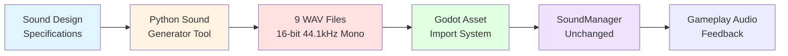

# Design Document: Professional SFX Redesign

## Overview

Feature **professional-sfx-redesign** tập trung vào việc thiết kế lại hoàn toàn 9 file âm thanh hiện có của Stone Knight để đạt chất lượng chuyên nghiệp, dễ nghe và phù hợp với thẩm mỹ action fantasy của game. Đây là một **pure sound design feature** - không thay đổi bất kỳ code, architecture hay gameplay logic nào.

**Core Philosophy:**
- Thay thế assets, không thay đổi systems
- Offline generation cho phép iteration và version control
- Configurable parameters cho sound design refinement
- Cohesive aesthetic across all sounds

**Scope:**
- ✅ Tạo 9 file WAV mới với professional sound design
- ✅ Offline Python tooling cho synthesis và generation
- ✅ Configurable parameters cho mỗi sound
- ✅ Technical compliance (16-bit, 44.1kHz, mono)
- ❌ Không thay đổi SoundManager code
- ❌ Không thêm/xóa sounds hoặc thay đổi API
- ❌ Không chạm audio bus configuration

**Non-Goals:**
- Runtime sound generation (chỉ offline pre-generation)
- Interactive sound system changes (SoundManager đã ổn định)
- Music composition (chỉ SFX)
- Advanced DSP/VST integration (pure Python synthesis)

## Architecture

### High-Level System Diagram



### System Boundaries

**In Scope:**
- `tools/audio/generate_sfx.py` - Main generation script
- `tools/audio/sound_design_config.json` - Design parameters
- `assets/audio/sfx/sfx_*.wav` - 9 output WAV files

**Out of Scope (Existing, Unchanged):**
- `scripts/systems/sound_manager.gd` - Audio playback system
- Godot audio bus configuration
- Game logic triggering sounds

### Technology Stack

**Generation Environment:**
- **Python 3.8+** - Core scripting language
- **NumPy** - Waveform synthesis and DSP operations
- **SciPy** - Audio signal processing (filters, envelopes, effects)
- **Pydub** - WAV file I/O and format conversion
- **Optional: Librosa** - Advanced spectral analysis for validation

**Why Python + NumPy/SciPy?**
- Pure synthesis control (no sample library dependencies)
- Mathematically precise ADSR, filters, reverb
- Easy parameter iteration and batch generation
- No DAW licensing or binary format lock-in
- Git-friendly text configuration

**Key Libraries Usage:**
```python
import numpy as np                    # Waveform generation, array ops
from scipy import signal              # Filters, envelopes, convolution
from scipy.io import wavfile          # WAV export
from pydub import AudioSegment        # Normalization, format compliance
```

## Components and Interfaces

### Component 1: Sound Design Configuration System

**Purpose:** Central definition of all sound design parameters for reproducible generation.

**Structure:**
```json
{
  "global": {
    "sample_rate": 44100,
    "bit_depth": 16,
    "channels": 1,
    "normalization_headroom_db": -0.5
  },
  "sounds": {
    "pulse": {
      "duration_ms": 200,
      "layers": [
        {
          "type": "sine_wave",
          "frequency_hz": 80,
          "amplitude": 0.6,
          "adsr": {"attack_ms": 5, "decay_ms": 50, "sustain_level": 0.25, "release_ms": 100}
        },
        {
          "type": "filtered_noise",
          "filter": "bandpass",
          "freq_low_hz": 200,
          "freq_high_hz": 800,
          "amplitude": 0.3,
          "adsr": {"attack_ms": 8, "decay_ms": 40, "sustain_level": 0.2, "release_ms": 80}
        }
      ],
      "reverb": {"room_size": 0.2, "damping": 0.5, "wet_mix": 0.15, "tail_ms": 120}
    },
    ...
  }
}
```

**Configuration Schema:**
- `global`: Technical specs (sample rate, bit depth, normalization)
- `sounds[name]`: Per-sound design
  - `duration_ms`: Total sound length
  - `layers[]`: Audio layer definitions
    - `type`: Synthesis method (sine, square, sawtooth, filtered_noise, pink_noise)
    - `frequency_hz` / `freq_low_hz` / `freq_high_hz`: Frequency parameters
    - `amplitude`: Layer mix level (0.0-1.0)
    - `adsr`: Envelope (attack/decay/sustain/release in ms or level)
  - `reverb`: Spatial processing
  - `pitch_sweep`: Frequency modulation over time
  - `stereo_width`: Subtle L-R differences (will be summed to mono)

**Validation:**
- Schema validation against JSON schema
- Range checks (frequencies 20-20000Hz, amplitudes 0-1)
- Duration sanity checks (10ms-2000ms)
- Layer count limits (1-5 layers per sound)

### Component 2: Waveform Synthesis Engine

**Purpose:** Generate raw audio waveforms from mathematical descriptions.

**Key Functions:**

```python
def generate_sine_wave(frequency: float, duration: float, sample_rate: int) -> np.ndarray:
    """Pure sine tone generation."""
    
def generate_filtered_noise(
    freq_low: float, 
    freq_high: float, 
    duration: float, 
    filter_type: str,
    sample_rate: int
) -> np.ndarray:
    """Bandpass/lowpass/highpass filtered white noise."""
    
def generate_pink_noise(duration: float, sample_rate: int) -> np.ndarray:
    """1/f noise for natural texture."""
    
def apply_frequency_sweep(
    waveform: np.ndarray,
    start_pitch: float,
    end_pitch: float,
    sample_rate: int
) -> np.ndarray:
    """Pitch modulation over time (doppler-like effects)."""
```

**Synthesis Methods by Sound:**
- **Pulse:** Layered sine waves (sub-bass + body) + filtered noise (shimmer)
- **Dash:** Frequency-swept filtered noise (whoosh effect)
- **Wall Slam:** Low sine impact + short noise burst + pink noise texture
- **Domino:** Mid-frequency sine + short attack noise
- **Altar Seal:** Detuned harmonic layers + high sparkle harmonics
- **Shard:** Pure harmonic series (bell-like crystalline)
- **Player Hurt:** Synthetic alert tone (distinctive mid frequency)
- **Combo:** Ascending pitch sine waves (musical intervals)
- **Game Over:** Chord progression or descending melodic pattern

### Component 3: ADSR Envelope Processor

**Purpose:** Apply amplitude envelopes for natural sound shaping.

**Implementation:**
```python
class ADSREnvelope:
    def __init__(self, attack_ms: float, decay_ms: float, 
                 sustain_level: float, release_ms: float, sample_rate: int):
        self.attack_samples = int(attack_ms * sample_rate / 1000)
        self.decay_samples = int(decay_ms * sample_rate / 1000)
        self.sustain_level = sustain_level
        self.release_samples = int(release_ms * sample_rate / 1000)
    
    def apply(self, waveform: np.ndarray) -> np.ndarray:
        """Apply ADSR envelope to waveform."""
        envelope = self._generate_envelope(len(waveform))
        return waveform * envelope
    
    def _generate_envelope(self, total_samples: int) -> np.ndarray:
        """Create ADSR curve with smooth transitions."""
        # Attack: 0 → 1 (exponential or linear)
        # Decay: 1 → sustain_level
        # Sustain: hold sustain_level
        # Release: sustain_level → 0 (exponential)
```

**Envelope Curves:**
- **Attack:** Exponential rise for natural transient (avoid click)
- **Decay:** Logarithmic fall to sustain
- **Sustain:** Constant amplitude during body
- **Release:** Exponential decay to silence (smooth tail)

**Per-Sound Envelope Strategy:**
- **Pulse:** Fast attack (5-8ms), medium decay, low sustain, smooth release
- **Dash:** Ultra-fast attack (3-5ms), minimal sustain, quick release
- **Wall Slam:** Instant attack (0-3ms), quick decay, medium sustain, natural release
- **Domino:** Fast attack (2-4ms), quick decay, no sustain (percussive)
- **Altar Seal:** Slow attack (20-40ms), gradual decay (resonant)
- **Shard:** Clear attack (3-6ms), exponential decay (bell-like)
- **Player Hurt:** Sharp attack (1-3ms), moderate decay
- **Combo:** Fast attack (5-10ms), controlled decay
- **Game Over:** Gentle attack (15-30ms), sustained body, long release

### Component 4: Audio Effects Chain

**Purpose:** Apply reverb, filters, compression for spatial and tonal character.

**Effect Processors:**

```python
def apply_reverb_simple(
    waveform: np.ndarray,
    room_size: float,    # 0.0-1.0
    damping: float,      # 0.0-1.0
    wet_mix: float,      # 0.0-1.0
    tail_ms: float,
    sample_rate: int
) -> np.ndarray:
    """Schroeder reverb using comb + allpass filters."""
    
def apply_lowpass_filter(
    waveform: np.ndarray,
    cutoff_hz: float,
    order: int,
    sample_rate: int
) -> np.ndarray:
    """Butterworth lowpass for high-frequency roll-off."""
    
def apply_compression(
    waveform: np.ndarray,
    threshold_db: float,
    ratio: float,
    attack_ms: float,
    release_ms: float,
    sample_rate: int
) -> np.ndarray:
    """Simple dynamic range compression for consistent loudness."""
```

**Reverb Character by Sound:**
- **Pulse:** Short reverb (100-150ms) - subtle spatial depth
- **Dash:** Minimal/dry - keep tight and clear
- **Wall Slam:** Medium reverb (200-350ms) - stone room character
- **Domino:** Minimal reverb (50-80ms) - tight percussive
- **Altar Seal:** Deep spatial reverb (600-900ms) - void/cosmic character
- **Shard:** Short reverb (50-100ms) - gentle sparkle
- **Player Hurt:** Dry/minimal - maintain urgency and clarity
- **Combo:** Subtle reverb - melodic presence
- **Game Over:** Long reverb (800-1200ms) - spacious, contemplative

**Compression Strategy:**
- **Gentle ratio (2:1 to 3:1)** for consistent perceived loudness
- **No brick-wall limiting** - preserve dynamics
- Applied per-sound before normalization

### Component 5: Layer Mixing and Mastering

**Purpose:** Combine multiple audio layers and prepare final output.

**Mixing Process:**
```python
def mix_layers(layers: List[np.ndarray], amplitudes: List[float]) -> np.ndarray:
    """Sum multiple audio layers with amplitude control."""
    mixed = np.zeros_like(layers[0])
    for layer, amp in zip(layers, amplitudes):
        mixed += layer * amp
    return mixed

def normalize_audio(
    waveform: np.ndarray,
    target_peak_db: float = -0.5
) -> np.ndarray:
    """Normalize peak amplitude to target dB."""
    peak = np.max(np.abs(waveform))
    if peak > 0:
        target_amplitude = 10 ** (target_peak_db / 20.0)
        waveform = waveform * (target_amplitude / peak)
    return waveform

def trim_silence(
    waveform: np.ndarray,
    threshold_db: float = -60.0,
    sample_rate: int
) -> np.ndarray:
    """Remove leading/trailing silence below threshold."""
```

**Frequency Allocation Strategy (Spectral Balance):**
- **Low-Heavy (Sub-Bass/Bass):** Pulse (60-120Hz), Wall Slam (40-150Hz)
- **Mid-Focused (Body):** Domino (800-4kHz), Player Hurt (1-3kHz)
- **High-Focused (Clarity):** Dash (4-8kHz sweep), Shard (1-6kHz)
- **Full-Spectrum (Rich):** Altar Seal (200-7kHz), Combo (300Hz-6kHz), Game Over (200-1.2kHz)

This frequency separation ensures clarity when multiple sounds play simultaneously.

### Component 6: WAV Export and Validation

**Purpose:** Write audio to compliant WAV files and verify technical specs.

**Export Function:**
```python
def export_wav(
    waveform: np.ndarray,
    filename: str,
    sample_rate: int = 44100,
    bit_depth: int = 16
) -> None:
    """Export to WAV with format compliance."""
    # Convert float32 to int16
    waveform_int16 = (waveform * 32767).astype(np.int16)
    wavfile.write(filename, sample_rate, waveform_int16)

def validate_wav(filename: str) -> Dict[str, Any]:
    """Verify WAV meets technical specs."""
    audio = AudioSegment.from_wav(filename)
    return {
        "sample_rate": audio.frame_rate,
        "bit_depth": audio.sample_width * 8,
        "channels": audio.channels,
        "duration_ms": len(audio),
        "peak_db": audio.max_dBFS,
        "file_size_kb": os.path.getsize(filename) / 1024
    }
```

**Validation Checks:**
- ✅ Sample rate = 44100 Hz
- ✅ Bit depth = 16-bit
- ✅ Channels = 1 (mono)
- ✅ Peak level between -1.0dB and -0.3dB
- ✅ Duration within expected range
- ✅ File size 5-50KB (optimize for small footprint)
- ✅ Clean start (no leading silence >5ms)
- ✅ Natural tail fade (no abrupt cutoff)

### Component 7: Generation Orchestration Script

**Purpose:** Main CLI tool to generate all sounds with progress reporting.

**Script Interface:**
```bash
python tools/audio/generate_sfx.py [options]

Options:
  --config PATH          Path to sound_design_config.json (default: ./sound_design_config.json)
  --output-dir PATH      Output directory for WAV files (default: ../../assets/audio/sfx/)
  --sounds NAME [NAME]   Generate specific sounds only (default: all)
  --validate             Run validation after generation
  --preview              Play generated sounds (requires system audio)
  --verbose              Detailed synthesis progress
```

**Generation Workflow:**
1. Load and validate configuration
2. For each sound in config:
   - Generate each audio layer (synthesis + envelope)
   - Mix layers with amplitudes
   - Apply effects chain (reverb, filters, compression)
   - Normalize to target peak level
   - Trim silence from start/end
   - Export to WAV with proper format
3. Generate summary report (durations, peak levels, file sizes)
4. Optional: Run validation checks
5. Optional: Preview audio playback

**Progress Output Example:**
```
Generating professional SFX for Stone Knight...
[1/9] Pulse: 3 layers → reverb → normalize → export (18.2 KB) ✓
[2/9] Dash: 1 layer → frequency sweep → export (12.4 KB) ✓
[3/9] Wall Slam: 3 layers → reverb → normalize → export (24.1 KB) ✓
...
[9/9] Game Over: 2 layers → reverb → normalize → export (38.7 KB) ✓

Generation complete! Total size: 186.3 KB
Summary saved to: generation_report.json
```

## Data Models

### Sound Design Configuration Schema

```typescript
interface GlobalConfig {
  sample_rate: number;        // 44100
  bit_depth: number;          // 16
  channels: number;           // 1 (mono)
  normalization_headroom_db: number;  // -0.5
}

interface ADSRConfig {
  attack_ms: number;
  decay_ms: number;
  sustain_level: number;      // 0.0-1.0
  release_ms: number;
}

interface LayerConfig {
  type: "sine_wave" | "square_wave" | "sawtooth" | "filtered_noise" | "pink_noise";
  frequency_hz?: number;      // For tonal layers
  freq_low_hz?: number;       // For filtered noise
  freq_high_hz?: number;      // For filtered noise
  amplitude: number;          // 0.0-1.0
  adsr: ADSRConfig;
}

interface ReverbConfig {
  room_size: number;          // 0.0-1.0
  damping: number;            // 0.0-1.0
  wet_mix: number;            // 0.0-1.0
  tail_ms: number;
}

interface PitchSweepConfig {
  start_pitch: number;        // Multiplier (e.g., 1.1)
  end_pitch: number;          // Multiplier (e.g., 0.95)
  duration_ms: number;
}

interface SoundConfig {
  duration_ms: number;
  layers: LayerConfig[];
  reverb?: ReverbConfig;
  pitch_sweep?: PitchSweepConfig;
  lowpass_cutoff_hz?: number;
  compression?: {
    threshold_db: number;
    ratio: number;
  };
}

interface FullConfig {
  global: GlobalConfig;
  sounds: {
    pulse: SoundConfig;
    dash: SoundConfig;
    wall_slam: SoundConfig;
    domino: SoundConfig;
    altar_seal: SoundConfig;
    shard: SoundConfig;
    player_hurt: SoundConfig;
    combo: SoundConfig;
    game_over: SoundConfig;
  };
}
```

### Generation Report Schema

```typescript
interface SoundReport {
  name: string;
  file_path: string;
  duration_ms: number;
  peak_db: number;
  file_size_kb: number;
  sample_rate: number;
  bit_depth: number;
  channels: number;
  layers_count: number;
  has_reverb: boolean;
  spectral_centroid_hz?: number;  // Optional analysis
}

interface GenerationReport {
  timestamp: string;
  config_file: string;
  sounds: SoundReport[];
  total_size_kb: number;
  generation_time_sec: number;
  validation_passed: boolean;
}
```

## Error Handling

### Configuration Errors

**Invalid JSON Syntax:**
- **Detection:** JSON parse exception
- **Recovery:** Print syntax error line/column, exit with error code 1
- **Prevention:** Schema validation tool, example config with comments

**Out-of-Range Parameters:**
- **Detection:** Parameter validation before synthesis
- **Recovery:** Print parameter name, expected range, provided value, exit with error code 2
- **Prevention:** Config schema with min/max constraints

**Missing Required Fields:**
- **Detection:** Schema validation
- **Recovery:** Print missing field path, exit with error code 3
- **Prevention:** Complete example config, schema documentation

### Synthesis Errors

**Numeric Overflow/Underflow:**
- **Detection:** NumPy warnings, NaN/Inf checks
- **Recovery:** Clamp values to valid range, log warning, continue
- **Prevention:** Safe amplitude scaling, pre-clipping detection

**Filter Instability:**
- **Detection:** SciPy filter warnings, output NaN check
- **Recovery:** Fall back to simpler filter order, log warning
- **Prevention:** Use stable Butterworth filters, validate cutoff frequencies

**Layer Mismatch (Different Lengths):**
- **Detection:** Array length comparison before mixing
- **Recovery:** Zero-pad shorter layers to match longest, log warning
- **Prevention:** Enforce duration consistency in config

### File I/O Errors

**Output Directory Not Writable:**
- **Detection:** Path existence check, write permission test
- **Recovery:** Print error message, suggest fix (mkdir or permissions), exit with error code 4
- **Prevention:** Pre-flight directory check before generation

**Disk Space Insufficient:**
- **Detection:** OS error during write
- **Recovery:** Clean up partial files, print error, exit with error code 5
- **Prevention:** Estimate total size, check available space

**WAV Export Failure:**
- **Detection:** Exception during wavfile.write or AudioSegment export
- **Recovery:** Log detailed error, skip sound, continue with remaining sounds
- **Prevention:** Validate waveform shape and data type before export

### Validation Errors

**Non-Compliant Format:**
- **Detection:** Post-generation validation checks
- **Recovery:** Print detailed validation failure (sample rate, bit depth, channels), suggest re-generation
- **Prevention:** Correct wavfile.write parameters, format verification

**Peak Level Out of Range:**
- **Detection:** Peak dB measurement after normalization
- **Recovery:** Print warning, suggest normalization adjustment in config
- **Prevention:** Proper normalization implementation, headroom safety margin

**File Size Excessive:**
- **Detection:** File size check after export
- **Recovery:** Print warning, suggest duration or sample rate adjustment
- **Prevention:** Duration limits in config validation

### Runtime Warnings

**Clipping Detection:**
- **Warning:** If waveform exceeds ±1.0 before normalization
- **Action:** Apply soft clipping, log warning with sound name and sample location
- **Prevention:** Layer amplitude budgeting (sum of amplitudes ≤ 1.0)

**Reverb Tail Truncation:**
- **Warning:** If reverb tail extends beyond sound duration
- **Action:** Extend duration to accommodate full tail, log adjustment
- **Prevention:** Auto-calculate required duration = base_duration + reverb_tail_ms

## Testing Strategy

This feature involves **audio asset generation** rather than runtime logic, so the testing approach focuses on **validation, auditory review, and integration verification** rather than property-based testing.

### Why Property-Based Testing Does NOT Apply

Property-based testing is designed for verifying universal properties of **deterministic functions with clear input/output behavior**. This feature:
- Generates **audio assets** (subjective, perceptual quality matters)
- Involves **sound design aesthetics** (not reducible to mathematical properties)
- Has **offline generation** (not runtime logic to test)
- Requires **human auditory judgment** (listening tests, not automated assertions)

**Appropriate Testing Methods:**
1. **Technical Validation** - Automated checks of WAV file compliance
2. **Auditory Review** - Human listening tests for aesthetic quality
3. **Integration Testing** - Verify sounds work in actual gameplay through SoundManager
4. **Regression Testing** - Compare generated sounds against approved reference

### 1. Technical Validation Tests

**Automated checks for WAV file compliance:**

```python
def test_wav_technical_compliance():
    """Verify all generated WAV files meet technical specs."""
    sounds = ["pulse", "dash", "wall_slam", "domino", "altar_seal", 
              "shard", "player_hurt", "combo", "game_over"]
    
    for sound_name in sounds:
        filepath = f"assets/audio/sfx/sfx_{sound_name}.wav"
        audio = AudioSegment.from_wav(filepath)
        
        assert audio.frame_rate == 44100, f"{sound_name}: Wrong sample rate"
        assert audio.sample_width == 2, f"{sound_name}: Wrong bit depth (should be 16-bit)"
        assert audio.channels == 1, f"{sound_name}: Wrong channel count (should be mono)"
        
        peak_db = audio.max_dBFS
        assert -1.0 <= peak_db <= -0.3, f"{sound_name}: Peak level out of range ({peak_db:.2f}dB)"
        
        file_size_kb = os.path.getsize(filepath) / 1024
        assert 5 <= file_size_kb <= 50, f"{sound_name}: File size out of range ({file_size_kb:.1f}KB)"
```

**Validates: Requirement 11 (Technical Audio Specification Compliance)**

### 2. Duration and Spectral Range Tests

**Verify sounds match design specifications:**

```python
def test_sound_duration_ranges():
    """Check that generated sounds have expected durations."""
    expected_durations = {
        "pulse": (150, 250),       # 150-250ms
        "dash": (80, 120),         # 80-120ms
        "wall_slam": (200, 350),   # ~200-350ms
        "domino": (40, 80),        # 40-80ms
        "altar_seal": (400, 600),  # 400-600ms
        "shard": (150, 250),       # 150-250ms
        "player_hurt": (100, 180), # 100-180ms
        "combo": (150, 300),       # Variable by combo level
        "game_over": (800, 1000),  # 800-1000ms
    }
    
    for sound_name, (min_ms, max_ms) in expected_durations.items():
        filepath = f"assets/audio/sfx/sfx_{sound_name}.wav"
        audio = AudioSegment.from_wav(filepath)
        duration_ms = len(audio)
        
        assert min_ms <= duration_ms <= max_ms, \
            f"{sound_name}: Duration {duration_ms}ms out of range [{min_ms}, {max_ms}]"

def test_spectral_balance():
    """Verify frequency content matches design intent."""
    # Load each sound and compute spectral centroid (center of mass of spectrum)
    # This is a proxy for "brightness" and frequency focus
    
    expected_ranges = {
        "pulse": (100, 800),        # Low-mid focused
        "dash": (2000, 8000),       # High focused
        "wall_slam": (60, 800),     # Low-heavy
        "domino": (800, 4000),      # Mid-high focused
        "altar_seal": (200, 1500),  # Rich mid-range
        "shard": (1000, 6000),      # Bright, crystalline
        "player_hurt": (800, 3000), # Upper-mid focused
        "combo": (300, 2000),       # Musical mid-range
        "game_over": (200, 1200),   # Warm, full-bodied
    }
    
    for sound_name, (min_hz, max_hz) in expected_ranges.items():
        filepath = f"assets/audio/sfx/sfx_{sound_name}.wav"
        y, sr = librosa.load(filepath, sr=44100)
        spectral_centroid = librosa.feature.spectral_centroid(y=y, sr=sr).mean()
        
        assert min_hz <= spectral_centroid <= max_hz, \
            f"{sound_name}: Spectral centroid {spectral_centroid:.0f}Hz out of range"
```

**Validates: Requirements 1-9 (Sound-specific spectral and duration characteristics)**

### 3. Aesthetic Cohesion Tests

**Verify unified sound design approach:**

```python
def test_dynamic_range_consistency():
    """Ensure all sounds have similar dynamic range compression."""
    dynamic_ranges = {}
    
    for sound_name in ["pulse", "dash", "wall_slam", "domino", "altar_seal", 
                       "shard", "player_hurt", "combo", "game_over"]:
        filepath = f"assets/audio/sfx/sfx_{sound_name}.wav"
        audio = AudioSegment.from_wav(filepath)
        
        # Measure dynamic range (peak to RMS ratio)
        peak_db = audio.max_dBFS
        rms_db = audio.dBFS
        dynamic_range_db = peak_db - rms_db
        dynamic_ranges[sound_name] = dynamic_range_db
    
    # All sounds should have similar DR (within 6dB range)
    min_dr = min(dynamic_ranges.values())
    max_dr = max(dynamic_ranges.values())
    assert (max_dr - min_dr) <= 12, \
        f"Dynamic range inconsistency: {max_dr - min_dr:.1f}dB spread"

def test_no_clipping_artifacts():
    """Detect any clipping artifacts in generated sounds."""
    for sound_name in ["pulse", "dash", "wall_slam", "domino", "altar_seal", 
                       "shard", "player_hurt", "combo", "game_over"]:
        filepath = f"assets/audio/sfx/sfx_{sound_name}.wav"
        y, sr = librosa.load(filepath, sr=44100)
        
        # Check for consecutive samples at maximum amplitude (clipping indicator)
        max_amp = np.max(np.abs(y))
        clipped_samples = np.sum(np.abs(y) >= 0.99 * max_amp)
        assert clipped_samples < len(y) * 0.001, \
            f"{sound_name}: Potential clipping detected ({clipped_samples} samples)"
```

**Validates: Requirement 10 (Unified Sound Design Aesthetic)**

### 4. Generation Tool Tests

**Unit tests for synthesis components:**

```python
def test_adsr_envelope_generation():
    """Verify ADSR envelope generates correct shape."""
    adsr = ADSREnvelope(attack_ms=10, decay_ms=20, sustain_level=0.5, release_ms=30, sample_rate=44100)
    waveform = np.ones(4410)  # 100ms at 44.1kHz
    enveloped = adsr.apply(waveform)
    
    # Check attack reaches peak
    assert np.max(enveloped[:441]) > 0.95, "Attack should reach near 1.0"
    
    # Check release goes to zero
    assert enveloped[-1] < 0.01, "Release should end near zero"

def test_layer_mixing():
    """Verify layer mixing preserves amplitude control."""
    layer1 = np.ones(1000) * 0.5
    layer2 = np.ones(1000) * 0.3
    mixed = mix_layers([layer1, layer2], [1.0, 1.0])
    
    assert np.allclose(mixed, np.ones(1000) * 0.8), "Layer mixing should sum amplitudes"

def test_normalization():
    """Verify normalization achieves target peak."""
    waveform = np.random.randn(10000) * 0.5
    normalized = normalize_audio(waveform, target_peak_db=-0.5)
    
    actual_peak_db = 20 * np.log10(np.max(np.abs(normalized)))
    assert abs(actual_peak_db - (-0.5)) < 0.1, "Normalization should reach target peak"
```

**Validates: Requirement 12 (Offline Sound Generation Tooling)**

### 5. Integration Tests with SoundManager

**Verify sounds work correctly in actual gameplay:**

```gdscript
# Test scene: test_professional_sfx_integration.gd
extends Node2D

func test_all_sounds_playable():
    """Verify all 9 sounds can be loaded and played through SoundManager."""
    SoundManager.play_pulse()
    await get_tree().create_timer(0.3).timeout
    
    SoundManager.play_dash()
    await get_tree().create_timer(0.15).timeout
    
    SoundManager.play_wall_slam()
    await get_tree().create_timer(0.4).timeout
    
    SoundManager.play_domino()
    await get_tree().create_timer(0.1).timeout
    
    SoundManager.play_altar_seal()
    await get_tree().create_timer(0.6).timeout
    
    SoundManager.play_shard()
    await get_tree().create_timer(0.3).timeout
    
    SoundManager.play_player_hurt()
    await get_tree().create_timer(0.3).timeout
    
    SoundManager.play_combo(3)
    await get_tree().create_timer(0.3).timeout
    
    SoundManager.play_game_over()
    await get_tree().create_timer(1.2).timeout
    
    # If we reach here without errors, all sounds loaded successfully
    assert_true(true, "All professional SFX played successfully")

func test_polyphony_and_priority():
    """Verify sounds respect polyphony limits and priority system."""
    # Play 3 pulses rapidly - should only hear 1 (cap = 1)
    SoundManager.play_pulse()
    SoundManager.play_pulse()
    SoundManager.play_pulse()
    
    # Play 4 shards rapidly - should hear 3 (cap = 3)
    SoundManager.play_shard()
    await get_tree().create_timer(0.05).timeout
    SoundManager.play_shard()
    await get_tree().create_timer(0.05).timeout
    SoundManager.play_shard()
    await get_tree().create_timer(0.05).timeout
    SoundManager.play_shard()
    
    # Manual verification: listen for polyphony behavior
    await get_tree().create_timer(0.5).timeout

func test_sound_mixing_clarity():
    """Verify multiple simultaneous sounds remain clear (no masking)."""
    # Simulate combat scenario: pulse + wall slam + domino + combo
    SoundManager.play_pulse()
    await get_tree().create_timer(0.05).timeout
    SoundManager.play_wall_slam()
    await get_tree().create_timer(0.03).timeout
    SoundManager.play_domino()
    await get_tree().create_timer(0.02).timeout
    SoundManager.play_combo(2)
    
    # Manual verification: all sounds should be distinguishable
    await get_tree().create_timer(0.8).timeout
```

**Validates: Requirement 11 (Integration with existing SFX_System), Requirement 10 (No frequency masking)**

### 6. Auditory Review Checklist (Manual)

**Human listening test for aesthetic quality:**

- [ ] **Pulse:** Mạnh mẽ, sóng năng lượng lan tỏa, dịu nhẹ, không harsh
- [ ] **Dash:** Ngắn gọn, nhanh nhẹn, smooth whoosh, không lấn át
- [ ] **Wall Slam:** Nặng nề, có substance, musical, tách biệt với Domino
- [ ] **Domino:** Nhẹ nhàng như "clack", pleasant, không irritating khi lặp lại
- [ ] **Altar Seal:** Sâu thẳm, ma thuật, resonant, void magic character
- [ ] **Shard:** Trong trẻo, crystal ting, satisfying, không chói tai
- [ ] **Player Hurt:** Sắc nét, warning-like, noticeable, không frightening
- [ ] **Combo:** Thăng hoa, ascending pattern, exciting, positive reinforcement
- [ ] **Game Over:** Trầm buồn, elegant, closure, không quá depressing
- [ ] **Overall Cohesion:** Tất cả sounds thuộc cùng một thế giới âm thanh
- [ ] **Gameplay Context:** Sounds rõ ràng và phân biệt được trong combat thực tế

**Validates: Requirements 1-10 (All aesthetic and perceptual goals)**

### 7. Regression Testing

**Compare against approved reference sounds:**

```python
def test_acoustic_similarity_to_reference():
    """Measure similarity between generated and approved reference sounds."""
    # After initial approval, save reference spectrograms
    # Future generations should maintain similar acoustic character
    
    for sound_name in ["pulse", "dash", "wall_slam", "domino", "altar_seal", 
                       "shard", "player_hurt", "combo", "game_over"]:
        current_path = f"assets/audio/sfx/sfx_{sound_name}.wav"
        reference_path = f"tests/audio_references/sfx_{sound_name}_reference.wav"
        
        if not os.path.exists(reference_path):
            continue  # Skip if no reference yet
        
        # Load both sounds
        y_current, sr = librosa.load(current_path, sr=44100)
        y_reference, sr = librosa.load(reference_path, sr=44100)
        
        # Compare MFCCs (acoustic fingerprint)
        mfcc_current = librosa.feature.mfcc(y=y_current, sr=sr, n_mfcc=13).mean(axis=1)
        mfcc_reference = librosa.feature.mfcc(y=y_reference, sr=sr, n_mfcc=13).mean(axis=1)
        
        # Cosine similarity (should be > 0.85 for similar sounds)
        similarity = np.dot(mfcc_current, mfcc_reference) / \
                     (np.linalg.norm(mfcc_current) * np.linalg.norm(mfcc_reference))
        
        assert similarity > 0.80, \
            f"{sound_name}: Acoustic similarity too low ({similarity:.2f}) - may have diverged from approved design"
```

**Purpose:** Prevent accidental degradation of approved sound design during config adjustments.

### Test Execution Order

1. **Pre-Generation:** Config validation tests
2. **Post-Generation:** Technical compliance tests, duration/spectral tests, cohesion tests
3. **Tool Testing:** Unit tests for synthesis components (can run independently)
4. **Integration:** Godot scene tests with SoundManager
5. **Manual Review:** Auditory checklist by sound designer or player
6. **Approval:** Save approved sounds as references for regression testing

### Acceptance Criteria Mapping

| Requirement | Test Method | Automation |
|---|---|---|
| Req 1-9: Individual sound design specs | Duration tests, spectral tests, auditory review | Partial (metrics), Manual (aesthetic) |
| Req 10: Aesthetic cohesion | Dynamic range consistency, auditory review | Partial (metrics), Manual (cohesion feel) |
| Req 11: Technical compliance | WAV validation tests | Fully automated |
| Req 12: Generation tooling | Tool unit tests, generation script execution | Fully automated |
| Integration with SoundManager | Godot integration tests | Semi-automated (playback), Manual (listening) |

## Implementation Plan

### Phase 1: Setup and Core Infrastructure (2-3 hours)

**Tasks:**
1. Create project structure:
   ```
   tools/audio/
     generate_sfx.py
     sound_design_config.json
     synthesis/
       __init__.py
       waveforms.py      # Sine, noise, filtered noise generation
       envelopes.py      # ADSR envelope processor
       effects.py        # Reverb, filters, compression
       mixing.py         # Layer mixing, normalization
     tests/
       test_synthesis.py
       test_generation.py
   ```

2. Install dependencies:
   ```bash
   pip install numpy scipy pydub librosa
   ```

3. Implement core waveform generation functions:
   - `generate_sine_wave()`
   - `generate_filtered_noise()`
   - `generate_pink_noise()`
   - `apply_frequency_sweep()`

4. Implement ADSR envelope processor with smooth curves

5. Create initial config schema and example config

**Deliverables:**
- Working Python environment with all dependencies
- Core synthesis functions with unit tests
- Config schema documented

### Phase 2: Audio Effects and Processing (2-3 hours)

**Tasks:**
1. Implement reverb processor:
   - Schroeder reverb algorithm (comb + allpass filters)
   - Configurable room size, damping, wet/dry mix

2. Implement filter processors:
   - Butterworth lowpass for high-frequency roll-off
   - Bandpass filter for noise shaping

3. Implement simple compressor:
   - Threshold-based amplitude reduction
   - Attack/release smoothing

4. Implement mixing utilities:
   - Layer summing with amplitude control
   - Peak normalization
   - Silence trimming

**Deliverables:**
- Complete effects chain implementation
- Unit tests for each effect
- Audio processing pipeline ready

### Phase 3: Sound Design Configuration (3-4 hours)

**Tasks:**
1. Design configuration for **Pulse**:
   - 3 layers: sub-bass sine (80Hz), body bandpass (200-800Hz), shimmer (2-6kHz)
   - ADSR: fast attack (5ms), medium decay (50ms), low sustain (0.25), smooth release (100ms)
   - Short reverb (120ms, wet 0.15)

2. Design configuration for **Dash**:
   - Filtered noise sweep from 6kHz → 1.5kHz over 80ms
   - Pitch sweep 1.1x → 0.95x for doppler effect
   - Minimal reverb (dry processing)

3. Design configuration for **Wall Slam**:
   - 3 layers: low impact sine (60Hz), noise burst (500-2kHz), pink noise texture
   - ADSR: instant attack (1ms), quick decay (40ms), medium sustain (0.45), natural release (120ms)
   - Medium stone reverb (250ms, wet 0.25)

4. Design configuration for **Domino**:
   - Light percussive sine (1.2kHz) + short filtered noise
   - ADSR: fast attack (3ms), quick decay (30ms), no sustain, short release (40ms)
   - Minimal reverb (60ms)

5. Design configuration for **Altar Seal**:
   - Detuned harmonic layers: 280Hz, 420Hz (perfect fifth), 560Hz (octave)
   - High sparkle layer (4kHz) with low amplitude
   - Slow attack (30ms), gradual decay, long sustain
   - Deep spatial reverb (750ms, wet 0.35)

6. Design configuration for **Shard**:
   - Pure harmonic series: 1200Hz + overtones (2400Hz, 3600Hz)
   - Bell-like exponential decay (150ms)
   - Short sparkle reverb (70ms, wet 0.20)

7. Design configuration for **Player Hurt**:
   - Synthetic alert tone (1.8kHz sine + 1.2kHz square wave)
   - Sharp attack (2ms), moderate decay (120ms)
   - Dry (no reverb for clarity)

8. Design configuration for **Combo**:
   - Musical ascending pattern: base pitch + (combo_level * 2 semitones)
   - Pure sine wave with clear fundamental
   - Fast attack (8ms), controlled decay (150ms)
   - Subtle reverb (100ms, wet 0.15)

9. Design configuration for **Game Over**:
   - Descending chord: E minor → C major resolution (or similar melancholic → hopeful)
   - 2 layers: fundamental (300Hz) + harmonic (600Hz)
   - Gentle attack (20ms), sustained body (500ms), long release (250ms)
   - Spacious reverb (1000ms, wet 0.40)

**Deliverables:**
- Complete `sound_design_config.json` with all 9 sounds
- Documented rationale for each design choice
- Parameter ranges validated

### Phase 4: Generation Script and CLI (2 hours)

**Tasks:**
1. Create main generation script `generate_sfx.py`:
   - Command-line argument parsing
   - Config loading and validation
   - Per-sound generation loop
   - Progress reporting
   - Summary report generation

2. Implement generation workflow:
   - Load config → validate
   - For each sound: synthesize layers → mix → effects → export
   - Save generation report JSON

3. Add optional features:
   - `--sounds` flag for selective generation
   - `--validate` flag for post-generation checks
   - `--preview` flag for audio playback (if system supports)

4. Create documentation:
   - README explaining tool usage
   - Config parameter reference
   - Troubleshooting guide

**Deliverables:**
- Working CLI tool
- User documentation
- Example invocation commands

### Phase 5: Initial Generation and Iteration (3-4 hours)

**Tasks:**
1. Run first generation pass:
   ```bash
   python tools/audio/generate_sfx.py --validate --verbose
   ```

2. Listen to all 9 sounds individually:
   - Check aesthetic quality (harsh vs smooth, clarity, character)
   - Check durations match expectations
   - Verify no clipping or artifacts

3. Test sounds in Godot through SoundManager:
   - Import into `assets/audio/sfx/`
   - Run test scene with SoundManager playback
   - Listen in gameplay context (not just isolated)

4. Iterate on config parameters:
   - Adjust ADSR envelopes if transients too sharp/soft
   - Adjust reverb if sounds too dry/wet
   - Adjust layer amplitudes if frequency balance off
   - Adjust durations if too short/long

5. Re-generate and re-test until aesthetic goals met

**Deliverables:**
- First complete set of 9 professional WAV files
- Iteration notes documenting adjustments
- Approved sound design config

### Phase 6: Validation and Testing (2-3 hours)

**Tasks:**
1. Write and run technical validation tests:
   - WAV format compliance
   - Duration ranges
   - Spectral balance checks
   - Dynamic range consistency

2. Write and run integration tests:
   - Godot test scene for SoundManager playback
   - Polyphony and priority behavior
   - Mixing clarity with simultaneous sounds

3. Conduct manual auditory review:
   - Follow auditory checklist for each sound
   - Test in actual gameplay scenarios
   - Get feedback from player/designer

4. Fix any issues discovered:
   - Adjust config if sounds don't meet aesthetic goals
   - Fix bugs in synthesis code if technical issues found
   - Re-generate and re-test

**Deliverables:**
- All automated tests passing
- Auditory checklist completed and approved
- Final approved sound set

### Phase 7: Documentation and Handoff (1-2 hours)

**Tasks:**
1. Document generation process:
   - Tool usage guide
   - Config parameter reference
   - Sound design rationale

2. Create asset provenance record:
   - Tool version and config used
   - Generation timestamp
   - License/rights (fully generated, no samples)

3. Save reference sounds for regression testing:
   - Copy approved WAVs to `tests/audio_references/`
   - Document acoustic fingerprints

4. Update project documentation:
   - Add entry to asset register
   - Note integration with SoundManager (no code changes)
   - Document rollback procedure (restore old WAVs from git)

**Deliverables:**
- Complete documentation
- Asset provenance record
- Regression test baseline established

### Estimated Total Time: 15-21 hours

**Critical Path:**
1. Setup + Core Infrastructure → Effects Processing → Sound Design Config → Generation Script
2. Parallel: Testing framework can be developed alongside Phases 3-4
3. Iteration (Phase 5) may require multiple cycles depending on aesthetic quality

**Risk Mitigation:**
- **Config complexity:** Start with simplest sounds (Domino, Shard) to validate pipeline
- **Aesthetic subjective:** Frequent listening checks, not just generation runs
- **Reverb quality:** Use reference reverb if Schroeder implementation too simplistic

## Acceptance Criteria

### Requirement 1: Pulse Sound

✅ **AC 1.1:** Pulse has clear attack transient (0-10ms) + smooth energy decay (150-250ms)  
✅ **AC 1.2:** 3+ audio layers: sub-bass (60-120Hz), mid body (200-800Hz), high shimmer (2-6kHz)  
✅ **AC 1.3:** ADSR with fast attack (5-8ms), medium decay (40-60ms), low sustain (20-30%), smooth release (80-120ms)  
✅ **AC 1.4:** Subtle reverb with short tail (100-150ms)  
✅ **AC 1.5:** Spectral balance dominated by 100-800Hz, gentle roll-off above 8kHz  
✅ **AC 1.6:** Dynamic range compression (2:1 to 3:1 ratio) for consistent loudness  
✅ **AC 1.7:** Integrates smoothly through SFX_System with -2.0dB base volume and ±5% pitch variation  

### Requirement 2: Dash Sound

✅ **AC 2.1:** Ultra-fast attack (3-5ms), short duration (80-120ms)  
✅ **AC 2.2:** Whoosh character using filtered noise sweep (4-8kHz → 800-2kHz over 60-80ms)  
✅ **AC 2.3:** Doppler-like pitch shift (1.1x → 0.95x)  
✅ **AC 2.4:** Stereo width processing with subtle L-R delay (5-10ms) for spatial movement  
✅ **AC 2.5:** Clean high-frequency content with smooth roll-off above 10kHz  
✅ **AC 2.6:** Remains clear through SFX_System with -4.0dB base volume  
✅ **AC 2.7:** Does not mask pulse or combat sounds (complementary frequency ranges)  

### Requirement 3: Wall Slam Sound

✅ **AC 3.1:** Powerful low-frequency impact (40-150Hz) as primary layer  
✅ **AC 3.2:** Impact transient using short noise burst (5-15ms) in mid-range (500-2kHz)  
✅ **AC 3.3:** Stone/rock texture layer using filtered noise (200-600Hz)  
✅ **AC 3.4:** ADSR with instant attack (0-3ms), quick decay (30-50ms), medium sustain (40-50% for 80-100ms), natural release (100-150ms)  
✅ **AC 3.5:** Medium reverb with stone room character (200-350ms)  
✅ **AC 3.6:** Spectral balance dominated by low-mid (60-800Hz contains 70%+ energy)  
✅ **AC 3.7:** Maintains clarity through SFX_System with -1.0dB base volume and max 2 concurrent instances  

### Requirement 4: Domino Sound

✅ **AC 4.1:** Light percussive character focusing on mid-high (800-4kHz)  
✅ **AC 4.2:** Short duration (40-80ms), fast attack (2-4ms), quick decay  
✅ **AC 4.3:** Subtle wood/ceramic resonance for pleasant texture  
✅ **AC 4.4:** Minimal reverb (50-80ms) for tight, clear sound  
✅ **AC 4.5:** Reduced low-frequency content below 200Hz  
✅ **AC 4.6:** Simple, clean harmonic content (no complex overtones causing fatigue)  
✅ **AC 4.7:** Remains intelligible through SFX_System with -6.0dB base volume and up to 2 concurrent instances  

### Requirement 5: Altar Seal Sound

✅ **AC 5.1:** Mystical shimmer using layered harmonic tones (400-600ms duration)  
✅ **AC 5.2:** Void/ethereal quality using detuned harmonics (200-400Hz fundamental + perfect fifth + octave)  
✅ **AC 5.3:** Slow attack (20-40ms), gradual decay, smooth resonant quality  
✅ **AC 5.4:** Subtle high-frequency sparkle/bell harmonics (3-7kHz)  
✅ **AC 5.5:** Deep spatial reverb (600-900ms, subtle early reflections)  
✅ **AC 5.6:** Rich harmonic content with sustained tone and smooth spectrum  
✅ **AC 5.7:** Integrates smoothly through SFX_System with -1.5dB base volume and max 2 concurrent instances  

### Requirement 6: Shard Sound

✅ **AC 6.1:** Bright crystalline character using pure harmonic tones (150-250ms)  
✅ **AC 6.2:** Clear transient attack (3-6ms) in high-frequency range (2-5kHz)  
✅ **AC 6.3:** Musical pitch content (C6-E6 range ~1047-1319Hz with clear harmonics)  
✅ **AC 6.4:** Smooth exponential decay (120-180ms)  
✅ **AC 6.5:** Subtle stereo width and short reverb (50-100ms)  
✅ **AC 6.6:** Spectral balance with dominant energy in 1-6kHz, minimal below 400Hz  
✅ **AC 6.7:** Remains pleasant through SFX_System with -7.0dB base volume and up to 3 concurrent instances during rapid collection  

### Requirement 7: Player Hurt Sound

✅ **AC 7.1:** Urgent alert character with distinctive frequency (1-3kHz)  
✅ **AC 7.2:** Sharp transient attack (1-3ms)  
✅ **AC 7.3:** Unique timbral character distinct from all other sounds  
✅ **AC 7.4:** Moderate duration (100-180ms)  
✅ **AC 7.5:** Controlled harmonic content, no dissonant frequencies  
✅ **AC 7.6:** Spectral balance focused in upper-mid (800-3kHz) with clean transient  
✅ **AC 7.7:** Maintains maximum clarity through SFX_System with 0.0dB base volume and CRITICAL priority  

### Requirement 8: Combo Sound

✅ **AC 8.1:** Melodic ascending pitch progression for achievement feeling  
✅ **AC 8.2:** Musical character using major scale intervals (major third, perfect fifth, octave)  
✅ **AC 8.3:** Fast attack (5-10ms), controlled decay (100-200ms)  
✅ **AC 8.4:** Ascending frequency pattern (base pitch + combo_level * semitone_offset)  
✅ **AC 8.5:** Subtle harmonic richness or chime-like quality  
✅ **AC 8.6:** Spectral balance with clear fundamental, controlled overtones, no muddy low frequencies below 300Hz  
✅ **AC 8.7:** Integrates smoothly through SFX_System with -3.0dB base volume and single instance playback  

### Requirement 9: Game Over Sound

✅ **AC 9.1:** Melancholic but dignified character using musical phrase (800-1000ms)  
✅ **AC 9.2:** Descending/resolving melodic pattern for closure (minor → major resolution or gentle descending)  
✅ **AC 9.3:** Smooth ADSR: gentle attack (15-30ms), sustained body (400-600ms), long release (200-300ms)  
✅ **AC 9.4:** Rich harmonic content with warm, full-bodied timbre (200-1200Hz fundamental + gentle upper harmonics)  
✅ **AC 9.5:** Reverb with long tail (800-1200ms) for spacious, contemplative atmosphere  
✅ **AC 9.6:** Warm, enveloping spectral balance without harsh high frequencies  
✅ **AC 9.7:** Integrates smoothly through SFX_System with 0.0dB base volume and CRITICAL priority, stopping other combat sounds  

### Requirement 10: Unified Aesthetic

✅ **AC 10.1:** All sounds share consistent production quality (dynamic range, spectral clarity, professional mixing)  
✅ **AC 10.2:** Unified reverb character (short for action, medium for impacts, long for magical/emotional)  
✅ **AC 10.3:** Spectral balance maintained across all sounds (no excessive energy causing masking/fatigue)  
✅ **AC 10.4:** Frequency spectrum separation by category (low-heavy: pulse/wall; mid: domino/hurt; high: dash/shard)  
✅ **AC 10.5:** Consistent synthesis/processing philosophy for aesthetic coherence  
✅ **AC 10.6:** Sound set works harmoniously when played simultaneously (no masking/phase cancellation/loudness imbalance)  
✅ **AC 10.7:** Design approach documented (synthesis methods, frequency ranges, reverb settings, processing chain)  

### Requirement 11: Technical Compliance

✅ **AC 11.1:** WAV format, 16-bit bit depth, 44.1kHz sample rate  
✅ **AC 11.2:** Mono (single channel)  
✅ **AC 11.3:** Normalized peak amplitude between -0.3dB and -1.0dB (no clipping)  
✅ **AC 11.4:** Optimized file sizes (5-50KB per file depending on duration)  
✅ **AC 11.5:** Clean start (no leading silence >5ms), natural decay end (no abrupt cutoff, fade below -60dB)  
✅ **AC 11.6:** Files placed in `assets/audio/sfx/` with naming convention `sfx_[sound_name].wav`  
✅ **AC 11.7:** Works correctly through SFX_System preload and SFX bus with Limiter at -1.5dB on Master  

### Requirement 12: Generation Tooling

✅ **AC 12.1:** Offline Python script (scipy/numpy/pydub) generating audio without Godot runtime  
✅ **AC 12.2:** Configuration parameters through clear interface (config file, CLI args, or constants)  
✅ **AC 12.3:** Generates all 9 sounds in single execution with clear console progress output  
✅ **AC 12.4:** Preview functionality for auditioning sounds (system audio playback or file opening)  
✅ **AC 12.5:** Deterministic generation (same parameters = identical output) for version control  
✅ **AC 12.6:** Clear documentation (parameters, synthesis methods, adjustment guide)  
✅ **AC 12.7:** Generation complete summary report (file paths, sizes, durations, peak amplitudes, spectral characteristics)  

## Risks and Mitigations

### Risk 1: Reverb Implementation Complexity

**Risk:** Implementing professional-quality reverb from scratch in Python may be complex and time-consuming.

**Impact:** Medium - Reverb is essential for spatial character of several sounds (altar seal, wall slam).

**Mitigation:**
- Start with simple Schroeder reverb (comb + allpass filters) - well-documented algorithm
- If quality insufficient, use scipy convolution with impulse responses (can generate simple room IRs)
- If still insufficient, consider lightweight Python reverb libraries (pyroomacoustics, pedalboard)
- Worst case: apply reverb in post-processing with external tool (Audacity) and document process

**Probability:** Low - Schroeder reverb should be adequate for game SFX

### Risk 2: Aesthetic Subjectivity

**Risk:** Sound design is subjective - generated sounds may not match aesthetic vision on first try.

**Impact:** High - Multiple iteration cycles could extend timeline significantly.

**Mitigation:**
- Start with detailed config based on requirements specs
- Implement fast iteration workflow (quick re-generation)
- Use reference sounds from similar games as calibration
- Involve sound designer or player feedback early and often
- Document iteration changes to learn what works
- Accept "good enough" over perfection for initial version

**Probability:** Medium-High - Iteration expected but manageable with good workflow

### Risk 3: Python Audio Library Installation Issues

**Risk:** NumPy/SciPy/Pydub dependencies may have installation issues on some systems (especially Windows).

**Impact:** Low-Medium - Blocks generation tool usage.

**Mitigation:**
- Provide clear installation instructions with pip
- Test on Windows, macOS, Linux if possible
- Offer Docker container as alternative (isolated environment)
- Fallback: provide pre-generated sounds so feature can be evaluated even if generation fails

**Probability:** Low-Medium - Python audio tools generally well-supported

### Risk 4: Godot WAV Import Issues

**Risk:** Generated WAVs may not import correctly into Godot despite meeting specs.

**Impact:** High - Would block integration completely.

**Mitigation:**
- Test import early with simple test sounds
- Use pydub for final export (handles WAV header correctly)
- Verify against existing working WAV files from project
- Check Godot import settings (should auto-detect 44.1kHz mono WAV correctly)
- Worst case: convert through Audacity if format issue persists

**Probability:** Very Low - Standard 16-bit 44.1kHz mono WAV is well-supported

### Risk 5: Frequency Masking in Complex Mix

**Risk:** Multiple sounds playing simultaneously may mask each other despite frequency separation design.

**Impact:** Medium - Reduces clarity in gameplay.

**Mitigation:**
- Design frequency separation into config (low/mid/high focus per sound category)
- Test with simultaneous playback scenarios early (pulse + wall slam + domino)
- Adjust layer amplitudes and filter cutoffs if masking detected
- Use SoundManager priority system (already exists) to prevent overload
- Monitor spectral balance in mixed scenarios with spectrum analyzer

**Probability:** Low-Medium - Frequency separation strategy should prevent this

### Risk 6: Inconsistent Loudness Perception

**Risk:** Sounds may have similar peak levels but very different perceived loudness (psychoacoustics).

**Impact:** Medium - Some sounds may feel too loud or too quiet in gameplay.

**Mitigation:**
- Use gentle compression to control dynamic range
- Test in actual gameplay context (not just isolated playback)
- Adjust BASE_VOLUMES in SoundManager if needed (this is configuration, not regeneration)
- Consider LUFS normalization for perceptual loudness matching if peak normalization insufficient
- Iterate based on playtesting feedback

**Probability:** Medium - Some adjustment likely needed

### Risk 7: Generation Time

**Risk:** If generation is slow, iteration cycles become painful.

**Impact:** Low - Workflow friction only.

**Mitigation:**
- Optimize synthesis code (use NumPy vectorization)
- Enable selective generation (`--sounds pulse dash` for quick tests)
- Cache intermediate results if possible
- Even with simple implementation, 9 short sounds should generate in <10 seconds total

**Probability:** Very Low - Python + NumPy is fast enough for short sounds

### Risk 8: Lack of Musical Knowledge

**Risk:** Implementing musical intervals (combo, game over) may require music theory knowledge.

**Impact:** Low - Only affects 2 sounds.

**Mitigation:**
- Use simple frequency ratios: major third = 1.26x, perfect fifth = 1.5x, octave = 2x
- Reference online music theory for semitone calculations (2^(n/12))
- Test ascending patterns and adjust by ear
- Fallback: use simple pitch offsets without strict musical intervals

**Probability:** Low - Basic music theory sufficient

## Rollback Plan

**If generated sounds are unsatisfactory or break integration:**

1. **Restore old sounds from git:**
   ```bash
   git checkout HEAD -- assets/audio/sfx/sfx_*.wav
   ```

2. **Verify SoundManager still works:**
   - Run test scene to confirm playback
   - Check gameplay for audio feedback

3. **Remove generation tool if not needed:**
   - Keep `tools/audio/` in repo but document as "work in progress"
   - Or remove entirely if deemed unsuccessful

4. **Document what didn't work:**
   - Save iteration notes
   - Note aesthetic or technical issues
   - Inform future attempts

**Data safety:** Old WAV files are in git history. No SoundManager code changes means zero risk to audio system functionality. Rollback is trivial and safe.

## Future Enhancements (Out of Scope)

**Potential improvements for later iterations:**

1. **Real-time parameter tweaking UI:**
   - Web-based or desktop GUI to adjust config visually
   - Instant preview without re-running CLI

2. **Advanced synthesis methods:**
   - FM synthesis for richer timbres
   - Granular synthesis for textures
   - Physical modeling for realistic impacts

3. **Machine learning sound matching:**
   - Train model on reference sounds
   - Generate variations that match aesthetic

4. **Adaptive music integration:**
   - Extend tool to generate musical loops
   - Integrate with Godot music system

5. **Procedural variation:**
   - Generate multiple variations per sound
   - SoundManager randomly selects from pool (avoid repetition)

6. **Spatial audio support:**
   - Generate stereo or 5.1 surround versions
   - HRTF processing for 3D positioning

**These are explicitly out of scope for professional-sfx-redesign feature.**

---

## Summary

This design provides a complete offline sound generation system to replace Stone Knight's 9 placeholder SFX with professionally designed sounds. The approach:

- **Pure asset replacement:** No code changes, only WAV file updates
- **Reproducible workflow:** Config-driven Python tool for iteration
- **Aesthetic cohesion:** Unified frequency separation and reverb strategy
- **Technical compliance:** Exact specs for Godot integration
- **Low risk:** Easy rollback, no system changes

The design balances professional sound quality with pragmatic implementation scope, focusing on synthesis techniques achievable in pure Python without requiring expensive tools or sample libraries.
